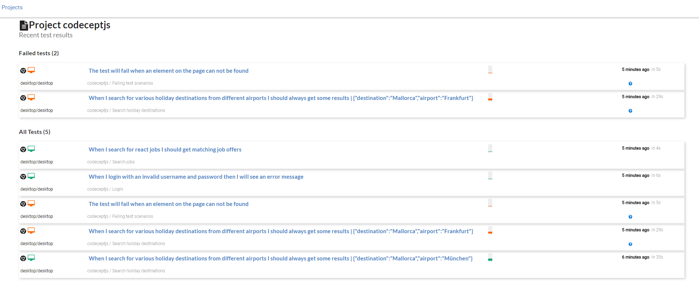
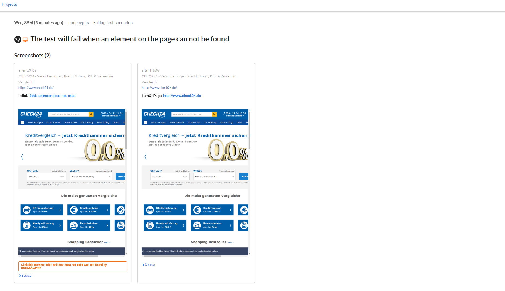
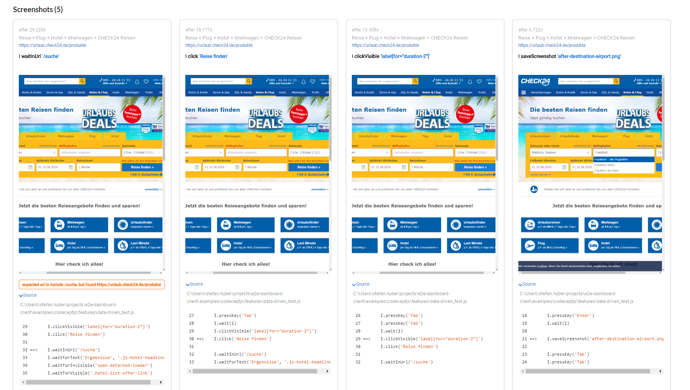

heimdall.io
=================================

Awesome reports for your E2E tests. Currently supporting

- codeceptjs
- ava-codeceptjs

## Quickstart

Use the docker-compose.yml

## Features

### View your project's test status

### Drill down into test details

### Look at screenshots and stacktraces

